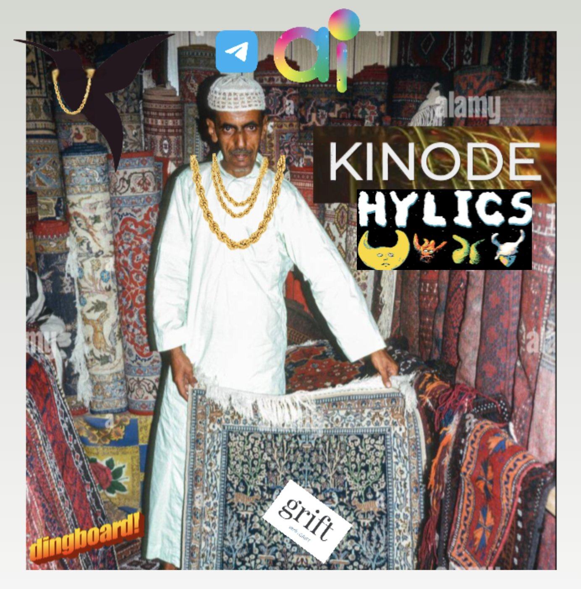
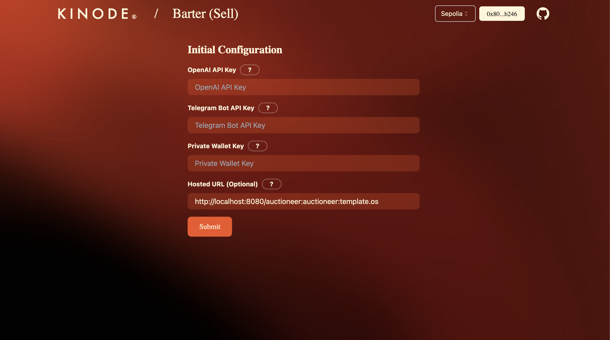
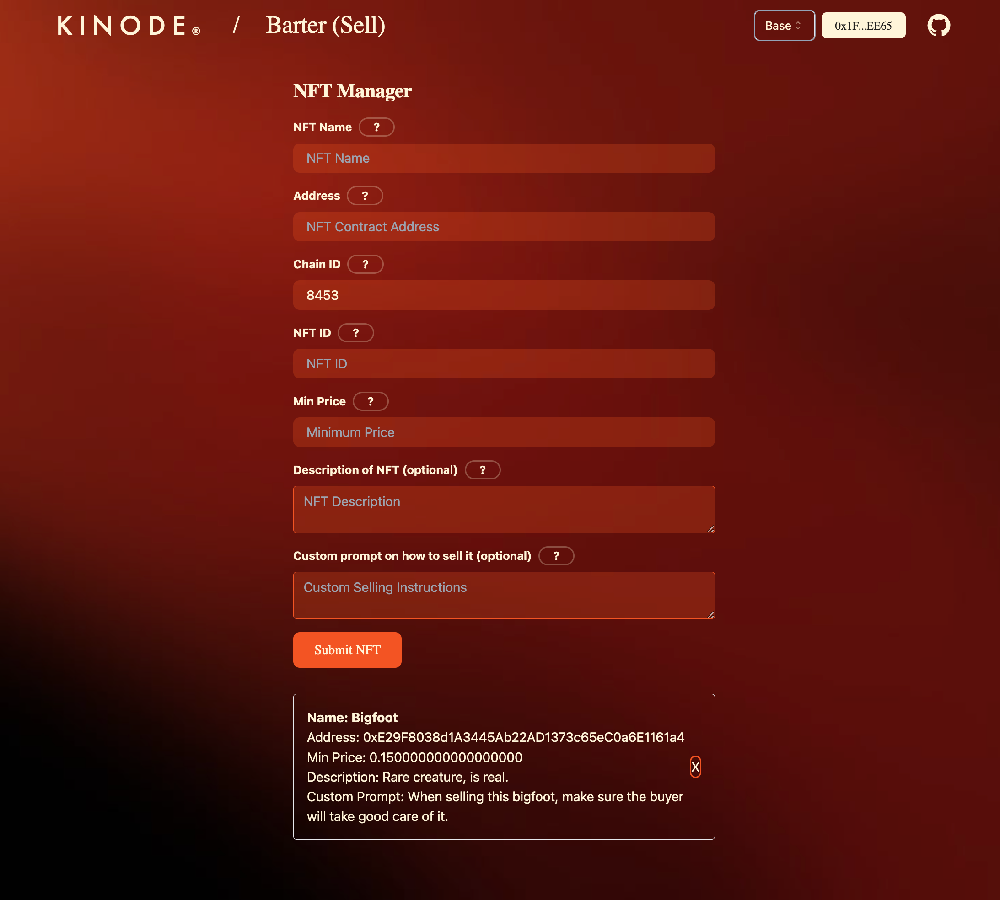
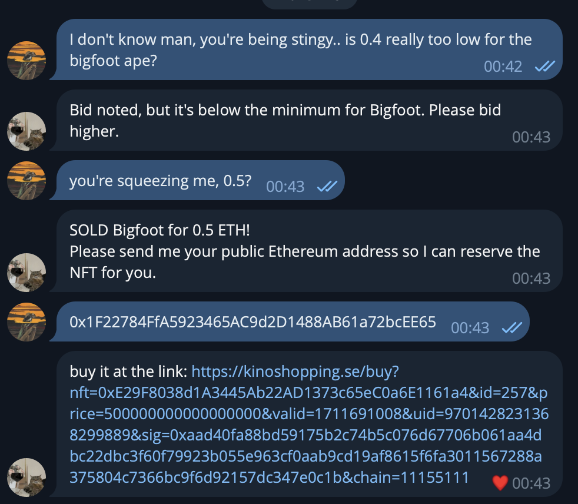
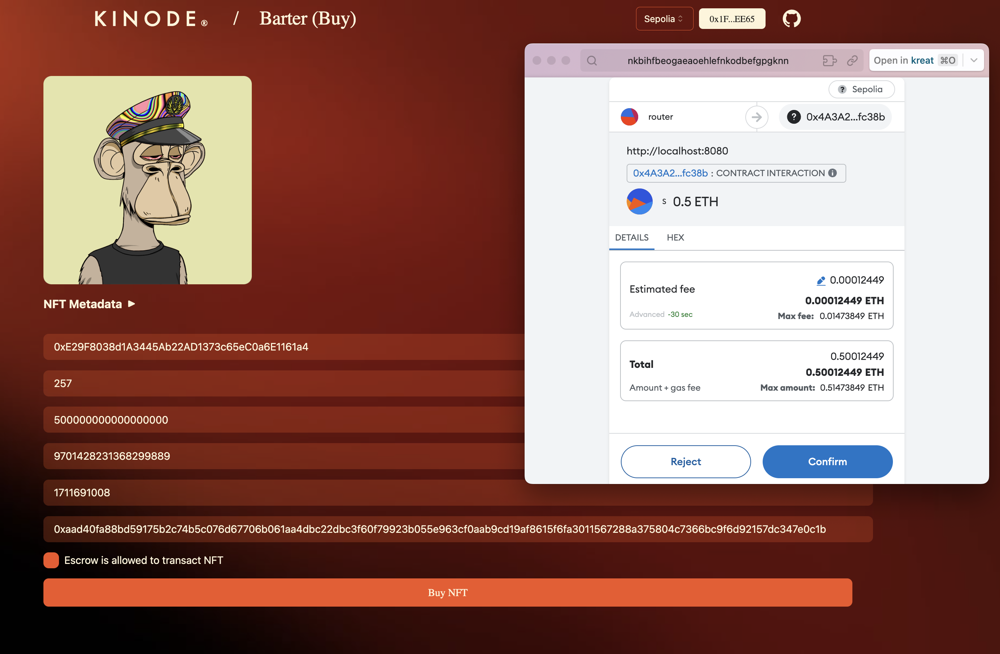

# Barter

Welcome to Barter, Kinode’s AI negotiator, an LLM assistant trained to help you sell your NFTs for the right price with none of the hassle.

Not only does Barter handle negotiation, sale, and transfer of your NFTs on telegram, but it also eliminates the listing and settlement fees of other NFT marketplaces like OpenSea.

## Requirements

- Kinode installed: [repo link](https://github.com/kinode-dao/kinode)
- Kit installed: [repo link](https://github.com/kinode-dao/kit)
- Openai API key with sufficient funds (we're using gpt-4-turbo for now, and have made efforts to keep the context as short as possible to save on costs.)
- Telegram bot API key (contact [botfather](https://telegram.me/BotFather) for keys)
- Private wallet key

## Installing from source

*Note: Only do this if you want to modify or publish the app yourself, otherwise install this from the kinode app store.*

Run `kit bs`, then visit `http://localhost:8080/main:barter:appattacc.os` to bring up the configuration when booting for the first time. In the initial configuration phase, you’ll have to add in an OpenAI API key, a Telegram Bot API key, and the wallet address which contains your NFTs.

Once the config is successfully submitted, you can add NFTs as you please by following the instructions on the NFT manager.

You can now message your TG bot at the link provided by botfather in the setup, and try to get it to make you the cheapest offer possible.

When a link has been sent by the bot, you can easily buy it f.ex. MetaMask.

